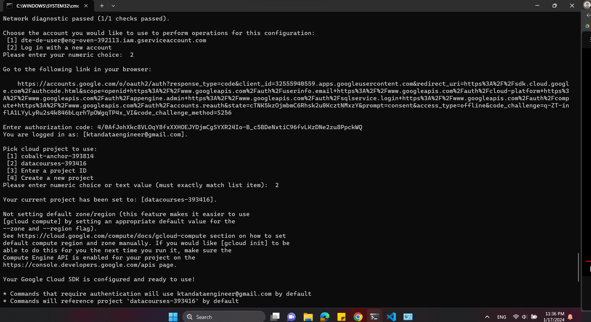

# Explain:
- 

# Step
- export GOOGLE_CREDENTIALS='/path/keys.json'
- echo $GOOGLE_CREDENTIALS
- note: before create resources, we should get terraform init to get provider
- terraform init
- create resources
- create terraform google cloud storage buckets
- 

# Run google init
- google inti --console-only 

- $env:GOOGLE_CREDENTIALS='E:/DE_2months/final_project/keys/datacourses-393416-d2653c914bfe.json': neu chay trong terminal
-  echo $env:GOOGLE_CREDENTIALS
- neu khong su dung google credential nua thi: unset $GOOGLE_CREDENTIALS // Remove-Item -Path env:GOOGLE_CREDENTIALS
- terraform init

# 