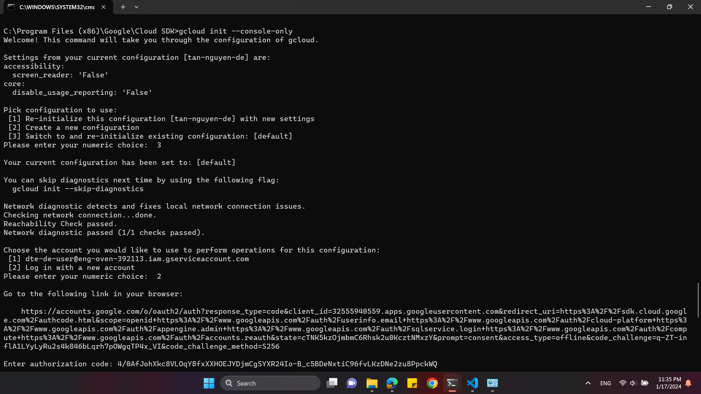

# Giới thiệu:
- Terraform là một công cụ mã nguồn mở cho phép định nghĩa Infrastructure as Code - IaC với đa dạng cloud provider như: AWS, GCP, Azure...Terraform giúp ta quản lý hệ thống bằng code và tự động hóa việc triển khai hệ thống. 
- Đặc điểm của Terraform:
    Quản lý tài nguyên đám mây đa nền 
    Quản lý các phiên bản khác nhau của cơ sở hạ tầng
    Quản lý phụ thuộc giữa các tài nguyên 
    Tự động hóa việc triển khai và cập nhật cơ sở hạ tầng

# Các bước GCP
- Tải Google Could CLI: https://cloud.google.com/sdk/docs/install
- Tạo project trên Google Cloud Platform, vào IAM & Admin tạo Service Account, generate key json
    export GOOGLE_CREDENTIALS='/path/keys.json'
    echo $GOOGLE_CREDENTIALS

# Các bước Terraform
- Lưu ý: before create resources, we should get terraform init to get provider
- google inti --console-only 

- $env:GOOGLE_CREDENTIALS='E:/DE_2months/final_project/keys/datacourses-393416-d2653c914bfe.json': neu chay trong terminal
-  echo $env:GOOGLE_CREDENTIALS
- neu khong su dung google credential nua thi: unset $GOOGLE_CREDENTIALS // Remove-Item -Path env:GOOGLE_CREDENTIALS
- terraform init
